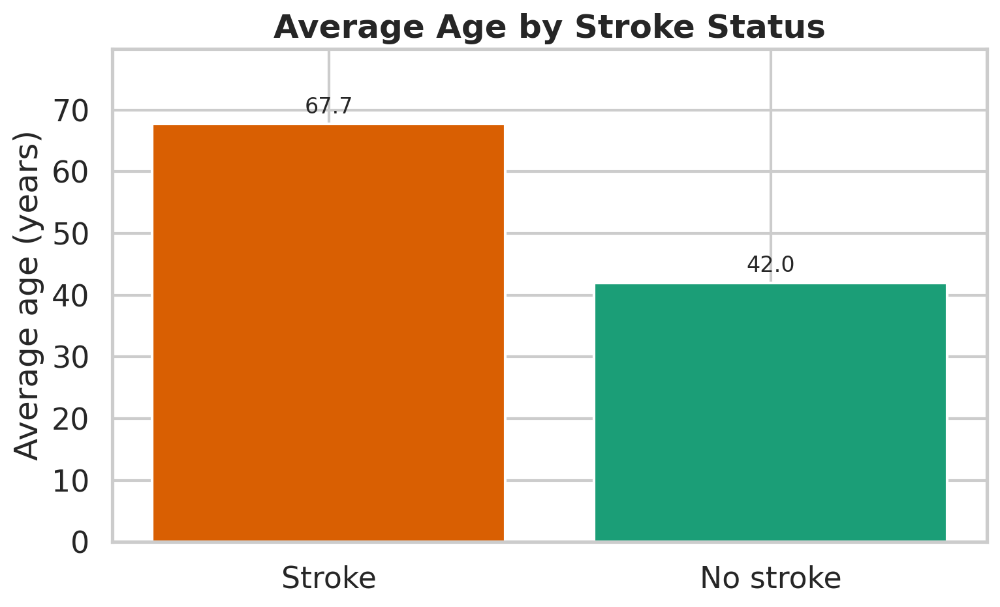
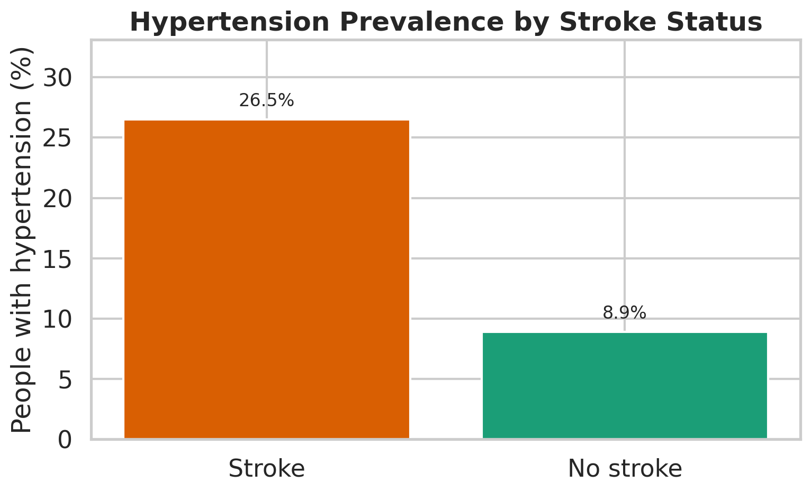
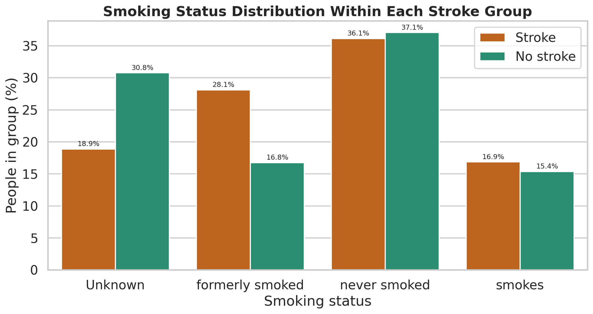

# Exploring Factors Associated with Stroke

This project explores a public healthcare dataset to identify key demographic, health, and lifestyle factors associated with strokes. The primary goal is to analyze variations in age, hypertension, and smoking history between individuals who have suffered a stroke and those who have not.

## 📊 Key Findings & Data Summary

| Metric | Group: Had Stroke | Group: No Stroke | Analysis / Key Takeaway |
| :--- | :---: | :---: | :--- |
| **Total Count** | 249 | 4,861 | Only **4.9%** of the 5,110 individuals in this dataset experienced a stroke. |
| **Average Age** | 67.7 years | 42.0 years | **Strong Link:** Stroke patients are **25.8 years older** on average, showing a strong age-related pattern. |
| **Hypertension (High BP)** | 26.5% | 8.9% | **3x Higher Risk:** High blood pressure is three times more common in the stroke group. |
| **Formerly Smoked** | 28.1% | 16.8% | **Significant:** A notably higher percentage of former smokers experienced strokes. |
| **Currently Smokes** | 16.9% | 15.4% | **Slight Link:** The percentage of current smokers is only marginally higher in the stroke group. |
| **Never Smoked** | 36.1% | 37.1% | **Neutral:** The percentage of lifelong non-smokers is almost identical in both groups. |
| **Unknown Smoking Status** | 18.9% | 30.8% | **Data Limitation:** A large portion of missing data must be kept in mind during final interpretation. |

---

## 📈 Visual Charts

### 1. Age Distribution Analysis
This chart compares the average age of individuals who experienced a stroke against those who did not, illustrating the older age distribution of the stroke group.

### 2. Hypertension Prevalence
This visualization tracks the percentage of hypertension within both groups, highlighting that high blood pressure is tripled among stroke patients.

### 3. Smoking Status Breakdown
This breakdown tracks the lifestyle patterns of both groups across different smoking history categories.

---

## 💡 Overall Takeaway
The data analysis reveals that strokes in this dataset are strongly associated with **older age**, a **higher prevalence of hypertension**, and a **history of former smoking**. 

*Disclaimer: These results indicate statistical associations within this specific dataset and do not serve as definitive scientific proof of direct causation.*

---

## 📜 Dataset Reference & Credit
* **Dataset Source:** [Stroke Prediction Dataset (Kaggle)](https://kaggle.com)
* **Dataset Creator:** **fedesoriano**
* **Context:** Originally published on Kaggle, this is the highest-rated and most downloaded public dataset available for stroke prediction analysis. It contains comprehensive clinical data ideal for exploratory data analysis (EDA).
